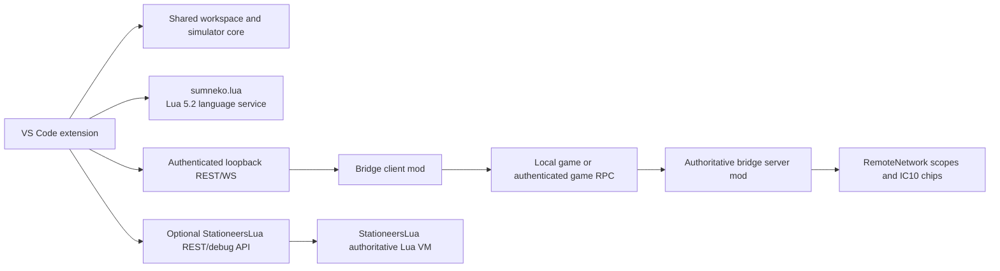

# P3 — Live game and Lua integration epic

## Outcome

Ship a separately installed Stationeers bridge mod and extend the VS Code
toolkit so a player can:

- place and label `RemoteNetwork` devices in a world;
- browse the IC10 and Lua chips reachable from those discovery scopes;
- compare, pull, and conflict-safely deploy IC10 source;
- use StationeersLua's own source and per-VM debugger where that optional mod
  can operate on the selected Lua chip; and
- run deterministic IC10 or Lua simulations and tests from git-persisted
  `*.stationeerssim.json` and `*.stationeerstest.json` files.

The StationeersLua VS Code extension is not required, but it may be installed
and active alongside this toolkit. This toolkit talks directly to the game
mod's public REST/debug services. General Lua editing is supplied by the
`sumneko.lua` extension. IC10 editing, simulation, and tests remain useful
without either game mod running. MCP integration is explicitly outside this
epic.

## Locked product decisions

These decisions may be changed only by editing this epic and recording the
reason before implementation:

| Area | Decision |
| --- | --- |
| Discovery boundary | The bridge discovers only networks deliberately marked by a `RemoteNetwork` device. It does not expose an unrestricted world graph. |
| Player naming | The trimmed labeller name on `RemoteNetwork` is the tree label. An unlabeled device is reported as a configuration warning and does not create a deployable scope. |
| Grouping | Deduplicate anchors only when physical network and exact trimmed label both match. Different labels on one physical network create distinct scopes; identical labels on different physical networks remain distinct. |
| Persistence | No custom persistent network ID is added. Labels persist in the world. API `scopeId` values are opaque, session-only routing handles and must never be saved as authority. |
| Chip identity | Mutations target the authoritative chip/housing reference plus current `worldEpoch`, source version, and hash. Every numeric game ID is serialized as a JSON string. |
| Device | `RemoteNetwork` is a distinct prefab derived from Logic Memory presentation and placement. It has two usable data ports, labeller support, a `Network` faceplate, the same recipe, and the same passive power behaviour. Vanilla Logic Memory is not modified. |
| Recipe | Match the currently documented Logic Memory recipe: 1 g gold and 1 g copper. Reconfirm in the supported game/export during implementation. |
| Local transport | The bridge owns a configurable authenticated loopback REST/WebSocket endpoint. The initial proposed port is `3032`; it must not collide with StationeersLua REST `3030` or LSP `3031`. |
| Multiplayer | VS Code talks to the local player's client mod. The client relays through the authenticated game connection to the authoritative server mod. A public dedicated-server IDE endpoint is not part of this epic. |
| StationeersLua | Optional and independently detected. Lua source/debug operations are delegated only when StationeersLua reports the same chip reference in its current editor/wireless scope. The bridge mod and StationeersLua game mod may be loaded together. |
| Extension ownership | This toolkit owns Stationeers discovery, source synchronization, simulation/testing, and remote-debug UX. `OrbitalFoundryModdingCrew.stationeers-lua` is neither a dependency nor a required integration surface, but its VS Code extension may coexist and must not prevent this extension from loading. |
| Lua language service | Declare `sumneko.lua` in `extensionDependencies` and integrate with its supported Lua 5.2 configuration/annotation facilities. Do not ship or start a competing general Lua language server. |
| Debugging | IC10 live breakpoint debugging is out of scope. Lua debugging uses StationeersLua's VM debugger and does not pause the main game thread. |
| Workspace formats | New canonical names are `*.stationeerssim.json`, `*.stationeerstest.json`, and `*.stationeerssim.layout.json`. Existing `*.ic10sim.json`, `*.ic10test.json`, and layout files remain readable. |
| MCP | No MCP server, proxy, dynamic tool registry, or MCP configuration writer is built here. Users may configure StationeersLua MCP themselves. |

## System boundary



The C# bridge owns global `RemoteNetwork` discovery and IC10 source access.
The toolkit connects directly to StationeersLua as a separate service with a
separate connection state. It does not call or depend on StationeersLua's VS
Code extension, and neither game service proxies the other.

## Delivery sequence

| Gate | Backlog item | Unblocks |
| ---: | --- | --- |
| 1 | [P3.01 Neutral workspace formats](p3-01-neutral-workspace-formats.md) | Language-neutral simulator/test inputs |
| 2 | [P3.02 Game API feasibility probes](p3-02-game-api-feasibility-probes.md) | Evidence for all C# implementation |
| 3 | [P3.03 RemoteNetwork game device](p3-03-remote-network-device.md) | Player-scoped live discovery |
| 4 | [P3.04 Bridge protocol and local read-only service](p3-04-bridge-protocol-readonly.md) | Stable discovery/pull contract |
| 5 | [P3.05 VS Code live network explorer](p3-05-vscode-live-network-explorer.md) | User-visible discovery and compare |
| 6 | [P3.06 Conflict-safe IC10 synchronization](p3-06-conflict-safe-ic10-sync.md) | Safe deployment |
| 7 | [P3.07 Authoritative multiplayer relay](p3-07-authoritative-multiplayer-relay.md) | Dedicated multiplayer support |
| 8 | [P3.08 Direct StationeersLua service integration](p3-08-stationeers-lua-integration.md) | Lua live source sync; debugger deferred |
| 9 | [P3.09 Lua simulator and test harness](p3-09-lua-simulator-testing.md) | Offline Lua tests |
| 10 | [P3.10 Integration hardening and release](p3-10-integration-hardening.md) | Supported release |

P3.01 and P3.02 may be developed independently, but later items must not bypass
their gates. P3.08 and P3.09 may proceed independently after their stated
dependencies.

## Common implementation rules

### Game-thread boundary

- Touch Unity/Stationeers objects only on the game main thread.
- Copy the smallest immutable DTO needed by the bridge, then serialize it
  off-thread.
- Route inbound commands through bounded queues and apply mutations at a safe
  tick boundary.
- Define maximum source sizes, request sizes, queue depths, work per tick, and
  connection counts. Backpressure coalesces discovery events or asks the
  client to resync; it never blocks the game loop.
- Use an initial bounded enumeration plus game events or a measured incremental
  reconcile. Never serialize or rescan the entire world on a timer.

### Identity and synchronization

- A discovery scope key is `(worldEpoch, physicalNetworkHandle, trimmedLabel)`.
  `physicalNetworkHandle` is an in-memory routing fact, not a persisted product
  identifier.
- A chip may appear under multiple scopes. That is intentional.
- File mappings use a human-readable selector such as network label, housing
  label, and language, then resolve to an authoritative chip reference each
  session. Ambiguous selectors require user choice.
- Every write supplies `worldEpoch`, chip reference, expected source version,
  and expected SHA-256. Stale or replaced targets fail closed.

### Dynamic capabilities

The extension derives UI state from live handshakes rather than installation
assumptions:

| Bridge | StationeersLua | Enabled |
| --- | --- | --- |
| absent | any | Offline IC10/Lua editing and implemented local simulation/testing only |
| present | absent | RemoteNetwork tree, IC10 pull/push, local simulation/testing |
| present | present | All bridge features plus StationeersLua actions for Lua chips currently reported by its API |

Lua chips discovered globally by the bridge remain visible even when
StationeersLua cannot currently operate on them. Their unavailable commands
must explain the editor/wireless scope requirement.

In this matrix, `StationeersLua` means the in-game mod's public service, never
its separately published VS Code extension. `sumneko.lua` provides ordinary
Lua language features in every scenario and does not affect live-game
capabilities.

## Evidence policy for game integration

Every game-facing item must create or update durable evidence under
`docs/live-integration/`. Evidence should contain:

- exact game, BepInEx, StationeersLaunchPad, bridge, and optional
  StationeersLua versions;
- inspected type/member names and how they were obtained;
- minimal probe source or test fixture;
- timestamped logs for success and failure cases;
- single-player, hosted multiplayer, and dedicated-server applicability;
- observed thread and authority context; and
- conclusions separated from remaining hypotheses.

Do not commit proprietary game assemblies, decompiled source, user tokens,
saves, or logs containing personal paths/server credentials.

## Repository validation baseline

Agents must verify current manifests before use. At the time this epic was
written, the baseline is:

```text
npm run check
npm test
npm run build
npm run package:extension
```

Game-mod items add their own C# build and game probe commands after P3.02
selects the legal project/toolchain shape. `npm run package:extension` is a
release-gate check, not a required inner-loop command for documentation-only
changes.

## Epic acceptance criteria

- [x] Canonical neutral workspace formats support mixed `.ic10` and `.lua`
      projects while all legacy IC10 fixtures remain readable.
- [ ] A distinct, save/load-safe `RemoteNetwork` device exposes deliberately
      labeled physical data networks without changing vanilla Logic Memory.
- [ ] Discovery follows the exact grouping rules in this epic, including
      duplicate chip appearances across scopes.
- [ ] The loopback bridge is authenticated, versioned, capability-negotiated,
      bounded, and safe across world changes.
- [ ] IC10 pull/compare/push rejects stale edits and stale targets.
- [ ] Multiplayer reads and writes execute only on the authoritative
      server/host under explicit permission and audit.
- [x] StationeersLua absence never disables IC10 or offline features.
- [ ] Installation and all supported live Lua workflows succeed with or
      without the StationeersLua VS Code extension.
- [x] `sumneko.lua` supplies Lua 5.2 language intelligence while this toolkit
      supplies generated Stationeers API annotations without duplicate general
      Lua diagnostics.
- [ ] Eligible Lua debug sessions are delegated to StationeersLua and pause
      only the selected Lua VM.
- [x] Local Lua 5.2 tests use deterministic Stationeers hardware mocks and
      declare unsupported APIs.
- [x] MCP remains absent from the bridge and extension implementation.
- [ ] Performance, security, compatibility, packaging, and user documentation
      gates in P3.10 pass.

## References

- [StationeersLua documentation](https://orbitalfoundrymodteam.github.io/StationeersLuaDocs/)
- [Extension REST API](https://orbitalfoundrymodteam.github.io/StationeersLuaDocs/guide/extension-rest-api.html)
- [Wireless Dev Board](https://orbitalfoundrymodteam.github.io/StationeersLuaDocs/guide/wireless-dev-board.html)
- [Debugging](https://orbitalfoundrymodteam.github.io/StationeersLuaDocs/guide/debugging.html)
- [Lua language server extension (`sumneko.lua`)](https://marketplace.visualstudio.com/items?itemName=sumneko.lua)
- [VS Code extension dependency manifest](https://code.visualstudio.com/api/references/extension-manifest)
- [Logic Memory recipe and behaviour](https://stationeers-wiki.com/Logic_Memory)

Upstream documentation can change. P3.08 must capture fixtures from the exact
supported version rather than relying on this backlog summary.

## Non-goals

- Unrestricted world/device browsing without a `RemoteNetwork` anchor.
- A stable player-managed ID for discovery scopes.
- A public or unauthenticated WebSocket.
- Direct IDE-to-dedicated-server access.
- Background two-way overwrite or name-only writes.
- IC10 live breakpoints or pausing the whole game loop.
- Reimplementing StationeersLua's VM, remote debugger, REST server, or MCP
  server inside the bridge mod.
- Calling commands or private APIs from the StationeersLua VS Code extension.
- Shipping a second general Lua language server alongside `sumneko.lua`.
- Full physical simulation of Stationeers.

## Decisions

- This epic replaces the former single `P3.01 — Live game bridge` item.
- Work is gated by reproducible evidence and acceptance checks, not a
  person-week estimate.
- `RemoteNetwork` scopes intentionally trade unrestricted discovery for
  explicit player control and meaningful persisted names.
