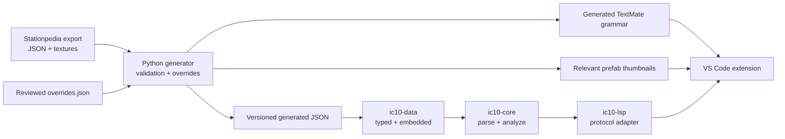

# Architecture and implementation roadmap

## Design constraints

The project keeps four concerns separate:

1. Game export transformation is a reproducible build-time operation.
2. IC10 parsing and analysis are editor- and protocol-independent.
3. The LSP crate translates core results into standard protocol messages.
4. The VS Code extension contains only client lifecycle, grammar, settings,
   native-server selection, and visual assets.

The released server embeds the JSON at compile time. The extension ships that
server and its thumbnails; no runtime path reaches into `STATIONEERS_DIR`.

## Why a purpose-built parser first

IC10 programs are at most 128 lines and each physical line is a label, an
instruction, or a comment. A compact error-tolerant parser gives predictable
latency, precise byte spans, and useful results for incomplete source without
adding a native grammar toolchain. Its public output is deliberately small, so
an incremental or tree-based parser can replace it later if multiline syntax or
more complex recovery appears in the game.

TextMate handles immediate lexical coloring. The Rust parser owns every feature
that needs meaning or navigation; highlighting therefore remains available even
if the language server is restarting.

## Package responsibilities

### `ic10-data`

- Deserializes generated JSON into typed Rust models.
- Embeds the generated files with `include_str!`.
- Provides instruction, enum, prefab-name, and prefab-hash lookup.
- Has no knowledge of LSP or VS Code.

### `ic10-core`

- Splits comments without treating `#` inside quoted macros as a comment.
- Tokenizes incomplete lines while preserving byte spans.
- Identifies labels, defines, aliases, instructions, and operands.
- Builds a document symbol table.
- Produces protocol-neutral diagnostics.

### `ic10-lsp`

- Stores open documents and reparses on full-text changes.
- Converts UTF-16 LSP positions to and from Rust byte offsets.
- Provides completion, hover, signature help, definitions, symbols, and
  diagnostics.
- Accepts the extension asset URI as initialization data for image hovers.

### `packages/vscode`

- Declares `.ic10`, the language configuration, grammar, command, and settings.
- Starts the matching native binary and restarts it on request.
- Sends its bundled thumbnail URI to the server.
- Falls back to `target/debug/ic10-lsp` during extension development.

## Data lifecycle

Generated JSON has an explicit schema version and the source game version.
Generation fails on unknown access modes, duplicate names, prefab-hash
collisions, malformed source shapes, or an instruction without a category.
This makes game updates visible during development instead of silently dropping
new information.

Corrections that are not present in the raw export belong in
`tools/stationpedia/overrides.json`. Broad transformation rules belong in
Python; one-off content fixes should stay in the override file so they are easy
to audit after every game update.

## Roadmap

### Milestone 1 — trustworthy syntax model

- Replace operand-count-only checks with typed operand validation.
- Track register and device aliases through the document.
- Validate numeric, binary, hexadecimal, `HASH`, and `STR` literals.
- Add quick fixes for common command/operand mistakes.
- Add golden parser and diagnostic fixtures from small original IC10 examples.

### Milestone 2 — device-aware semantics

- Infer a device prefab from `define` plus batch/device instructions.
- Filter `LogicType` and `LogicSlotType` completion by the inferred device.
- Diagnose unsupported read/write logic types and invalid slot indexes.
- Surface modes, slots, connections, and memory details in structured hovers.
- Resolve aliases and defines in prefab-hash hover/navigation paths.

### Milestone 3 — control flow and program analysis

- Build a control-flow graph for labels, jumps, branches, and relative branches.
- Diagnose unreachable code and definitely missing return targets.
- Track obvious constant values without pretending IC10 is statically typed.
- Add references and rename for labels, defines, and aliases.
- Add formatting and semantic tokens once their behavior is well specified.

### Milestone 4 — release engineering

- Choose the final extension identifier, publisher, repository URL, and license.
- Build and attach native binaries for Windows, Linux, and macOS architectures.
- Add VS Code Extension Test coverage for activation and hover image rendering.
- Add reproducibility checks that regenerate data against a pinned fixture.
- Publish game-data update notes with the Stationeers version in each release.

