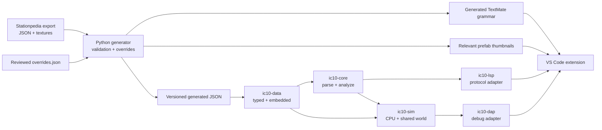

# Architecture and implementation roadmap

## Design constraints

The project keeps four concerns separate:

1. Game export transformation is a reproducible build-time operation.
2. IC10 parsing and analysis are editor- and protocol-independent.
3. The LSP crate translates core results into standard protocol messages.
4. The VS Code extension contains only client lifecycle, grammar, settings,
   native-server selection, and visual assets.
5. IC10 execution is a deterministic, editor-independent shared-world
   simulator exposed to VS Code through a separate debug adapter.

The released server embeds the JSON at compile time. The extension ships that
server and its thumbnails; no runtime path reaches into `STATIONEERS_DIR`.

## Why a purpose-built parser first

IC10 programs are at most 128 lines and each physical line is a label, an
instruction, or a comment. A compact error-tolerant parser gives predictable
latency, precise byte spans, and useful results for incomplete source without
adding a native grammar toolchain. Its public output is deliberately small, so
an incremental or tree-based parser can replace it later if multiline syntax or
more complex recovery appears in the game.

TextMate handles immediate lexical coloring. The Rust parser owns every feature
that needs meaning or navigation; highlighting therefore remains available even
if the language server is restarting.

## Package responsibilities

### `ic10-data`

- Deserializes generated JSON into typed Rust models.
- Embeds the generated files with `include_str!`.
- Provides instruction, enum, prefab-name, and prefab-hash lookup.
- Has no knowledge of LSP or VS Code.

### `ic10-core`

- Splits comments without treating `#` inside quoted macros as a comment.
- Tokenizes incomplete lines while preserving byte spans.
- Identifies labels, defines, aliases, instructions, and operands.
- Builds a document symbol table.
- Produces protocol-neutral diagnostics.

### `ic10-lsp`

- Stores open documents and reparses on full-text changes.
- Converts UTF-16 LSP positions to and from Rust byte offsets.
- Provides completion, hover, signature help, definitions, symbols, and
  diagnostics.
- Accepts the extension asset URI as initialization data for image hovers.

### `packages/vscode`

- Declares `.ic10`, the language configuration, grammar, command, and settings.
- Starts the matching native binary and restarts it on request.
- Sends its bundled thumbnail URI to the server.
- Falls back to `target/debug/ic10-lsp` during extension development.
- Provides the visual `*.ic10sim.json` environment editor and dense IC state
  debug view.
- Registers `ic10-dap`, with one debug thread per simulated IC housing.

### `ic10-sim`

- Strictly compiles executable instructions from the protocol-neutral parser.
- Models devices, numbered connections, cable channels, pins, registers,
  stacks, and device memory in one shared world.
- Schedules each IC deterministically with the game tick and instruction
  limits embedded in `ic10-data`.
- Has no dependency on VS Code or the Debug Adapter Protocol.

### `ic10-dap`

- Translates VS Code debug requests into `ic10-sim` operations.
- Exposes breakpoints, one thread per IC, editable variables, watches,
  instruction steps, and world-tick steps.
- Runs independently from the LSP so editor analysis and mutable simulation
  state have separate lifecycles.

## Data lifecycle

Generated JSON has an explicit schema version and the source game version.
Generation fails on unknown access modes, duplicate names, prefab-hash
collisions, malformed source shapes, or an instruction without a category.
This makes game updates visible during development instead of silently dropping
new information.

Corrections that are not present in the raw export belong in
`tools/stationpedia/overrides.json`. Broad transformation rules belong in
Python; one-off content fixes should stay in the override file so they are easy
to audit after every game update.

## Roadmap

The original architecture milestones have evolved into an ordered,
implementation-ready backlog. See [the backlog index](../backlog/README.md) for
priorities, dependencies, design constraints, and acceptance criteria.
